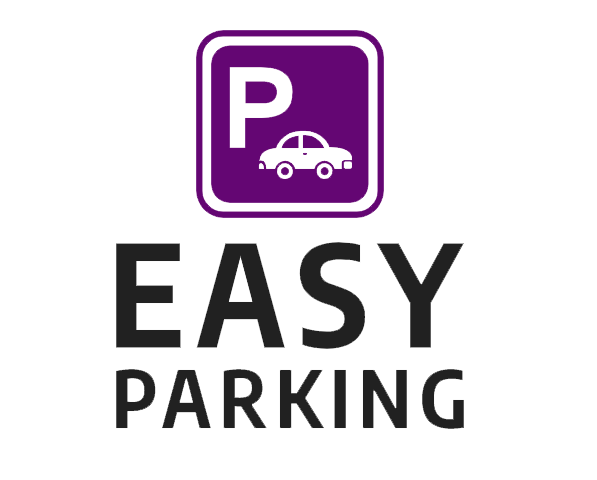

# SPRINT 1 Definición del proyecto - Proyecto ARSW - Easy Parking 

# Logo:

    

# Resumen

Easy Parking - Sistema de gestion de Estacionamiento para Establecimientos

Esta es una aplicacion web diseñada para darle un soporte de gestion totalmente tecnologico integrando los sistemas IoT (Internet of Things) del establecimiento consiguiendo el máximo beneficio, productividad y control.

# Descripcion

contara con dos tipos de usuarios y vistas:

- **Interfaz/vista Administrador:**

    - contara con un sistema para gestionar las posiciones y pisos del estacionamiento
    - tambien mostrara como un mapa con cada piso y lugares de estacionamiento donde cada lugar tendra una opcion para bloquear/abrir cada espacio del estacionamiento, 
    - opcion para traer la informacion de los dispositivos IoT (dispositivos que bloquean o permiten el espacio a un lugar en el estacionamiento) y se sincronize con el mapa del estacionamiento para que este actualize o alimente cuando un lugar a sido ocupado o esta libre.
    - Notificaciones y alertas constantes con el estado en tiempo real del estacionamiento

    - **usuarios que interactuan:**

        - usuario administrador.

- **Interfaz/vista usuario que usa el estacionamiento:** 

    - sera un tablero donde se mostraran los pisos en color ROJO/VERDE si están libres o no.
    - si estan libres selecciona el piso y se le mostraran los lugares libres donde el usuario escogera ese lugar y se le confirmara el lugar exacto de este.
    - esta vista se alimentara tambien de la informacion de los dispositivos IoT para tener actualizado en tiempo real los lugares disponibles.

    - **usuarios que interactuan:**

        - usuario normal.

- **conectar con dispositivos IoT:** 

    - dispositivos IoT (sensores, mecanismos de bloqueo) que sirvan para identificar y bloquear/permitir el paso en el espacio asignado del estacionamiento. y a su vez envian informacion al sistema para sincronizar su informacion.

## Necesidades que cubre nuestro proyecto

- poder tener un sistema tecnologico funcionando las 24h donde gestione y controle un estacionamiento.

## Problemas que se resuelven

- Evita bloqueo y largas filas en los estacionamientos.
- llevar un mejor control y orden en el estacionamiento.
- Actuar eficazmente cuando el estacionamiento colapse (fines de semana, festivos o fechas especiales):
    - gracias a las alertas se da tiempo a crear un plan estrategico poniendo nuevos lugares o boqueando las entradas ya que el sistema notificara cuando ya se este excediendo el limite.

## Nicho de Mercado

- Establecimientos grandes como:
    - Centros Comerciales.
    - edificios corporativos.
    - conjuntos residenciales.

## Principales Competidores

- [4PARK_PRO](https://imasdetres.com/sistema-control-accesos-gestion-parking/) : sistema de gestion de parking 
    - no conecta sus sistemas de control.

## Valor añadido

- Poder conectar todo gracias a IoT, ofreciendo estadisticas y una gestion y administración practica comodamente desde una oficina.

- Como es un sistema dinamico, se puede implementar facilmente a las necesidades del cliente convirtiendolo en un sistema para gestion de otras cosas como por ejemplo (sistema para abrir y cerrar las puertas del establecimiento).

# Historias de usuario

# Autor

* **ANDRES DAVID VASQUEZ IBAÑEZ** - *Initial work* - [VASHIGO](https://github.com/vashigo)

# Licencia

This project is licensed under the GNU General Public License - see the [LICENSE](LICENSE) file for details